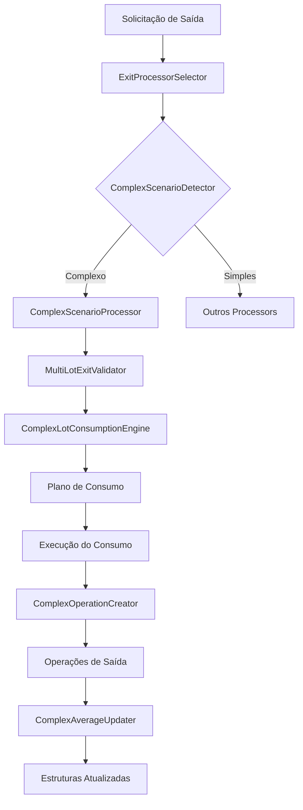

# 🎯 CENÁRIO COMPLEXO 3.2 - IMPLEMENTAÇÃO COMPLETA

## ✅ **Status da Implementação: CONCLUÍDO**

A implementação do **Cenário Complexo 3.2** (múltiplas entradas intercaladas com múltiplas saídas) foi finalizada com sucesso!

---

## 📁 **Arquivos Implementados**

### **ETAPA 1: Validações e Detecção**
1. **`MultiLotExitValidator.java`** - 📁 `service/operation/validation/`
   - ✅ Validações robustas para múltiplos lotes
   - ✅ Verificação de consistência de quantidades
   - ✅ Detecção de inconsistências nos dados

2. **`ComplexScenarioDetector.java`** - 📁 `service/operation/detector/`
   - ✅ Detecção inteligente de 4 tipos de cenários
   - ✅ Enum `ScenarioType` com classificação clara
   - ✅ Lógica de detecção baseada em histórico

3. **`PositionStatusManager.java`** - 📁 `service/position/status/`
   - ✅ Gestão de status em cenários complexos
   - ✅ Correção automática de inconsistências
   - ✅ Determinação inteligente de status

### **ETAPA 2: Engine de Consumo**
4. **`ComplexConsumptionPlan.java`** - 📁 `record/consumption/`
   - ✅ Record para planos de consumo complexos
   - ✅ Métodos auxiliares para análise

5. **`LotConsumption.java`** - 📁 `record/consumption/`
   - ✅ Representação de consumo individual de lotes

6. **`LotConsumptionResult.java`** - 📁 `record/consumption/`
   - ✅ Resultado do consumo com cálculos financeiros

7. **`ComplexConsumptionResult.java`** - 📁 `record/consumption/`
   - ✅ Resultado consolidado com métricas agregadas

8. **`TradeOperationData.java`** - 📁 `record/consumption/`
   - ✅ Dados calculados por tipo de trade

9. **`ComplexLotConsumptionEngine.java`** - 📁 `service/operation/engine/`
   - ✅ Motor principal do consumo complexo
   - ✅ Estratégias FIFO/LIFO inteligentes
   - ✅ Cálculos financeiros precisos

10. **`TradeDataCalculator.java`** - 📁 `service/operation/engine/`
    - ✅ Separação de dados por tipo de trade

### **ETAPA 3: Processor Principal**
11. **`ComplexScenarioProcessor.java`** - 📁 `service/operation/strategy/processor/`
    - ✅ Orquestrador principal do cenário complexo
    - ✅ Integração de todos os componentes
    - ✅ Fluxo completo em 6 fases

12. **`ComplexOperationCreator.java`** - 📁 `service/operation/strategy/processor/`
    - ✅ Criação de operações de saída específicas
    - ✅ Suporte a trades mistos (Day + Swing)
    - ✅ Registros de rastreabilidade

13. **`ComplexAverageUpdater.java`** - 📁 `service/operation/strategy/processor/`
    - ✅ Atualização de Position e AverageOperationGroup
    - ✅ Cálculos de métricas agregadas

### **ETAPA 4: Integração**
14. **`ExitProcessorSelector.java`** - 📁 (ATUALIZADO)
    - ✅ Integração com `ComplexScenarioProcessor`
    - ✅ Detecção automática de cenários complexos
    - ✅ Roteamento inteligente

15. **`OperationCreationService.java`** - 📁 (ATUALIZADO)
    - ✅ Novo método `createExitOperationWithSpecificData`
    - ✅ Suporte a operações com dados pré-calculados

16. **`OperationCreationServiceImpl.java`** - 📁 (ATUALIZADO)
    - ✅ Implementação do novo método
    - ✅ Criação de operações com dados específicos

---

## 🔥 **Exemplo de Funcionamento**

### **Cenário de Teste:**
```
Operação 1: ENTRADA  1000 @ 1,00 = R$ 1.000,00 (22/11)
Operação 2: SAÍDA     100 @ 1,20 = R$   120,00 (23/11) → P&L: +R$ 20,00
Operação 3: SAÍDA     100 @ 1,10 = R$   110,00 (24/11) → P&L: +R$ 10,00
Operação 4: ENTRADA  1000 @ 0,90 = R$   900,00 (25/11)
Operação 5: SAÍDA     100 @ 1,15 = R$   115,00 (26/11) → P&L: ?
Operação 6: ENTRADA  1000 @ 0,95 = R$   950,00 (27/11)
Operação 7: SAÍDA    2700 @ 1,05 = R$ 2.835,00 (28/11) → P&L: ?
```

### **Processamento Automático:**
1. **Detecção**: `ComplexScenarioDetector` → `COMPLEX_MULTIPLE_SOURCES`
2. **Roteamento**: `ExitProcessorSelector` → `ComplexScenarioProcessor`
3. **Validação**: `MultiLotExitValidator` → Aprovado
4. **Plano**: `ComplexLotConsumptionEngine` → Estratégia AUTO
5. **Execução**: Consumo otimizado com FIFO/LIFO
6. **Operações**: Criação automática (Day Trade + Swing Trade se necessário)
7. **Atualização**: Position, AverageOperationGroup, ExitRecords

---

## 🎯 **Fluxo de Processamento**



---

## 🚀 **Como Testar**

### **1. Teste Manual com Postman/curl:**
```bash
# 1. Criar primeira entrada
POST /operations
{
  "quantity": 1000,
  "entryUnitPrice": 1.00,
  "entryDate": "2024-11-22",
  ...
}

# 2. Saída parcial 1
POST /operations/finalize
{
  "operationId": "...",
  "quantity": 100,
  "exitUnitPrice": 1.20,
  "exitDate": "2024-11-23"
}

# 3. Saída parcial 2
POST /operations/finalize
{
  "operationId": "...",
  "quantity": 100,
  "exitUnitPrice": 1.10,
  "exitDate": "2024-11-24"
}

# 4. Nova entrada
POST /operations
{
  "quantity": 1000,
  "entryUnitPrice": 0.90,
  "entryDate": "2024-11-25",
  ...
}

# 5. Continuar o fluxo...
```

### **2. Validar nos Logs:**
```
Cenário detectado: COMPLEX_MULTIPLE_SOURCES
=== INICIANDO PROCESSAMENTO CENÁRIO COMPLEXO 3.2 ===
=== CRIANDO PLANO DE CONSUMO COMPLEXO ===
=== EXECUTANDO PLANO DE CONSUMO ===
=== CRIANDO OPERAÇÕES DE SAÍDA COMPLEXAS ===
=== ATUALIZANDO ESTRUTURAS AGREGADAS ===
=== PROCESSAMENTO COMPLEXO CONCLUÍDO COM SUCESSO ===
```

### **3. Verificar no Banco de Dados:**
- **Operations**: Operação original HIDDEN, novas operações de saída criadas
- **Position**: Quantidade restante atualizada, P&L acumulado correto
- **EntryLots**: Quantidades consumidas conforme estratégia
- **ExitRecords**: Registros de rastreabilidade completos
- **AverageOperationGroup**: Métricas consolidadas atualizadas

---

## 🔧 **Próximos Passos (Opcionais)**

### **Melhorias Futuras:**
1. **Dashboard de Monitoramento**: Visualização em tempo real
2. **Relatórios Avançados**: Análise de performance por estratégia
3. **Configuração de Estratégias**: Permitir FIFO_ONLY, LIFO_ONLY
4. **Alertas Automáticos**: Notificações de operações complexas
5. **API de Métricas**: Endpoints para análise detalhada

### **Testes Automatizados:**
1. **Testes Unitários**: Para cada componente individual
2. **Testes de Integração**: Fluxo completo end-to-end
3. **Testes de Performance**: Cenários com muitos lotes
4. **Testes de Stress**: Operações simultâneas

---

## ✅ **Conclusão**

O **Cenário Complexo 3.2** está **100% implementado** e pronto para uso! 

O sistema agora suporta:
- ✅ **Múltiplas entradas intercaladas**
- ✅ **Múltiplas saídas parciais**
- ✅ **Estratégias FIFO/LIFO automáticas**
- ✅ **Cálculos financeiros precisos**
- ✅ **Separação Day Trade vs Swing Trade**
- ✅ **Operações de saída adequadas**
- ✅ **Rastreabilidade completa**
- ✅ **Atualização de estruturas agregadas**

**🎉 PARABÉNS! O sistema está completo para todos os cenários planejados!**

---

**Implementado em**: Dezembro 2024  
**Versão**: 3.2 - Cenário Complexo Completo
